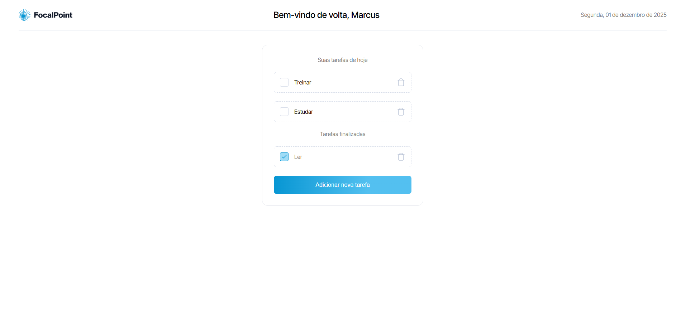

## 📌 Índice

- [Sobre](#-sobre)
- [Tecnologias utilizadas](#-tecnologias-utilizadas)
- [Como baixar o projeto](#-como-baixar-o-projeto)

---

## 🔖 Sobre

Esse projeto fez parte de um desafio técnico feito pela Legaplan que se baseou no desenvolvimento de uma **lista de tarefas**!

<h3 align="center">
    <a href="https://teste-dev-junior-xi.vercel.app/">Acessar a demonstração</a>
<h3>

---

## 🚀 Tecnologias utilizadas

O projeto foi desenvolvido utilizando as seguintes tecnologias:

- [NextJS](https://nextjs.org/)
- [SCSS](https://sass-lang.com/)

---

## 🗂 Como baixar o projeto

```bash
    # Clonar o repositório
    $ git clone https://github.com/bagrielz/to-do-list

    # Entrar no diretório
    $ cd teste-dev-junior

    # Instalar as dependências
    $ npm install

    # Iniciar o projeto
    $ npm run dev
```

---

Desenvolvido 🤘 por Gabriel Stênio
